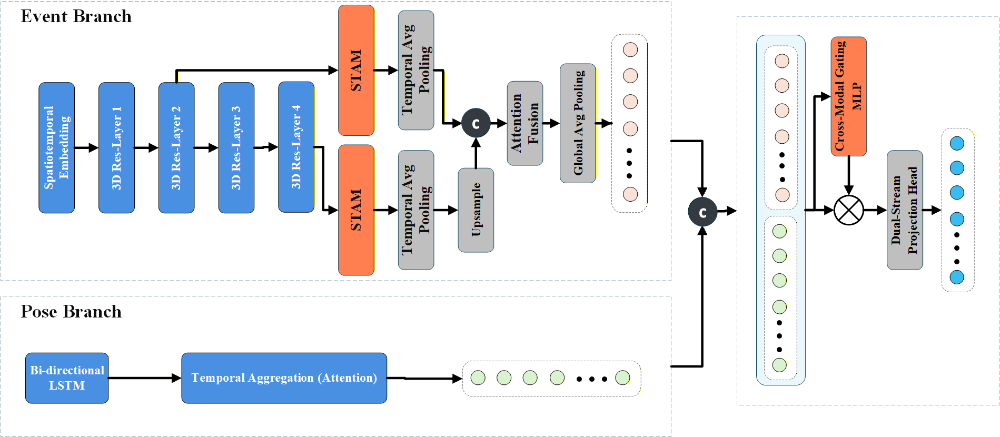

# Neuro-Pose
Paper code: Neuromorphic bullying detection network based on multi-scale spatio-temporal attention and asymmetric gated fusion




# Environment

* Ubuntu 18.04 / 20.04
* Python 3.8+
* PyTorch 1.10.0+ (Tested on 2.0.0 + CUDA 11.8)
* Dependencies can be installed via:

```bash
pip install -r requirements.txt

# Dataset

### An example of the dataset directory structure is organized as follows, where each folder contains:

```text
/dataset_root
    ├── train_keypoints.json
    ├── val_keypoints.json
    ├── Fingerguess/
    │   ├── video_001.npy
    │   └── ...
    ├── Kicking/
    │   ├── video_102.npy
    │   └── ...
    └── ...
```

* .npy files represent the event streams transformed into frames.
* .json files represent the pose keypoints (COCO format).
* You should follow the format and organize your own data in a `dataset` folder.

### Training sets

* [Bullying10K](https://www.brain-cog.network/dataset/Bullying10k/)

### Test sets

* [Bullying10K](https://www.brain-cog.network/dataset/Bullying10k/)


# Training

* Please set the train dataset path using `--data_root` in the command, then run `train.py` with Python.

```bash
python train.py --data_root ./dataset --gpu 0 --epochs 150 --batch_size 64 --aux_loss_weight 0.2
```

* In the [network](network) folder we have provided the core model python file, namely "TAM_model.py", which includes the `MS_STANet_Pose` architecture used in our experiments.


# Evaluation

* Please set the test dataset path (same as data_root) and run `train.py` with Python, adding the `--test_only` flag.

```bash
python train.py --test_only --checkpoint_path ./runs_output/best_model.pth --data_root ./dataset
```
